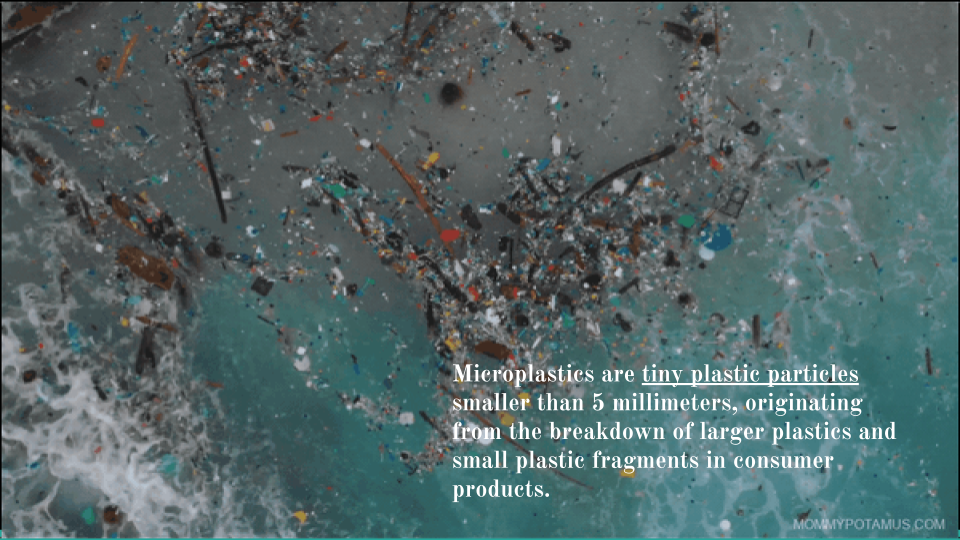

# Microplastics: Origins, Global Impact, and Key Contributors

## Overview
This project uses data analytics to explore the origins, evolution, and global impact of microplastic pollution, focusing on plastic production and waste management practices across countries and continents. Python was used for exploratory data analysis (EDA), and Tableau was utilized to create visualizations aimed at communicating the findings to a non-technical audience.

**Note:** The project is presented as a PowerPoint to showcase key data visualizations effectively to non-technical audiences. The visual approach allows complex data and trends to be more accessible and comprehensible, especially for stakeholders unfamiliar with technical data analysis.

## Team Members:
- **Suhaee Abro**: Investigated the origins, evolution of plastic production and global waste management practices and how long will plastics linger in surface oceans?
- **Sarah Watson**: Analyzed the global impact of microplastics, particularly on human health and ecosystems.
- **Marie Lordes Corti**: Examined which countries and financial institutions invest in plastic production.

## Data and Tools Used:
- **Python**: Performed basic EDA to process and clean the dataset.
- **Tableau**: Created data visualizations for presenting insights to a broader audience.

## Visualizations:
The Tableau visualizations focus on:
1. **Global Plastic Production Trends**
2. **Waste Management Practices by Country and Continent**
3. **Top Countries Contributing to Ocean Plastic Pollution**
4. **Financial Institutions and Countries Investing in Plastic Production**

## Motivation
Microplastic pollution is a growing environmental crisis with severe impacts on marine life, ecosystems, and human health. This project aims to bring greater awareness to the issue by using data to highlight key contributors and trends in plastic production and waste mismanagement.

## Conclusion
Our analysis underscores the need for stricter waste management practices, better regulation, and greater investment in sustainable plastic alternatives. Through this project, we aim to drive attention toward actionable solutions for reducing microplastic pollution.

## How to Use
- View the PDF file for detailed visualizations and analysis.

## References and Datasets
- https://www.ncbi.nlm.nih.gov/pmc/articles/PMC7920297/pdf/nanomaterials-11-00496.pdf
- Microplastic dataset from Kaggle - https://www.kaggle.com/datasets/william2020/marine-microplastics/data
- FAOSTAT was used for all food balances for 2022 - https://www.fao.org/faostat/en/#data/FBS
- Plastic waste makers index from Kaggle: https://www.kaggle.com/datasets/pranav941/the-plastic-makers-index?select=Who+Produce+the+most.csv
- https://ourworldindata.org/where-does-plastic-accumulate

